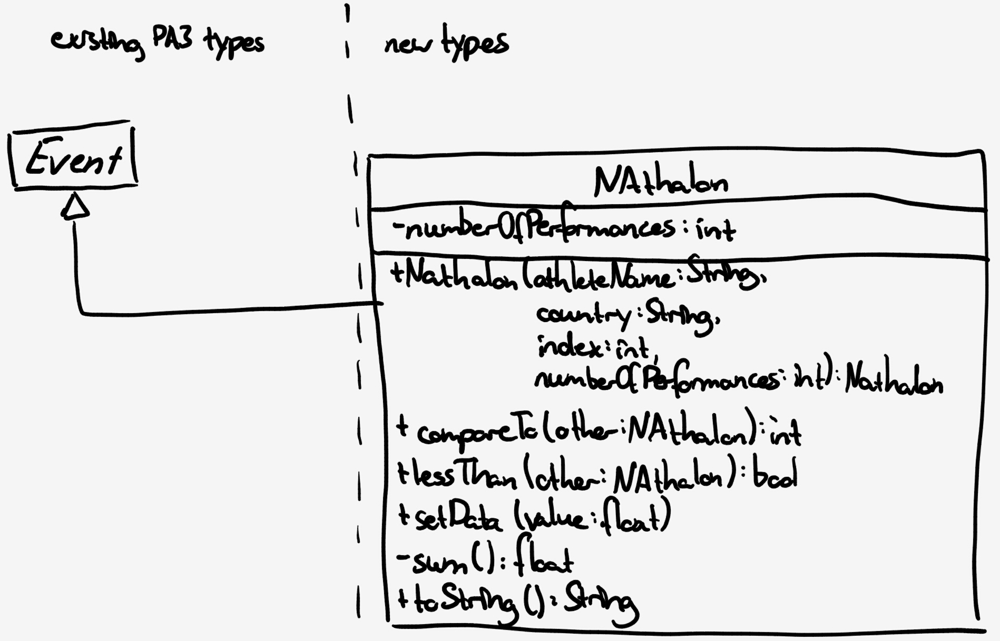

# Written Report

Remarks

- The implementation of my factory method in ``EventParser`` deviates from the suggested code in the specification. It effectively behaves in the same way, as a factory method.

## 1. Keep track of how much time you spend designing, coding and correcting errors, and how many errors you need to correct.

### Time spent designing
Apart from mentally designing while reading the specification twice in the beginning (~20 min), I did not formulate an explicit, documented design, as the assignment seemed simple enough.

### Time spent coding
I spent three hours coding.

### Time spent correcting errors
As I coded using Eclipse, it is difficult to say how much time I spent "correcting errors", as immediate syntax and semantic checks highlight potential problems while coding, some of which I might have noticed by myself, others not.

I misunderstood the specification for part A at first, thinking that the Event class should refer to a single attempt made by an athlete, rather than all attempts of one athlete taken together. This led to an additional hour of making changes back and forth.

This was partly caused by the required naming of the method ``setData(float value)``, which in my opinion does not represent the potential effects of the method well, clashing with what a ``set`` method is normally expected to do. For ``Distance`` events, this method does not actually set the value, but has to add another attempt to the list of attempts.

### How many errors I had to correct
1 (see explanation above - syntax errors not considered)


## 2. Keep  a  log  of what  proportion  of  your errors come from  design  errors and  what proportion from coding/implementation errors.

- Design errors:	1 (100%)
- Coding errors:	0


## 3. How would you extend the program to process results for the Decathalon and Heptathalon events?

Assumptions:

- The input file contains (instead of distance or time values) the points achieved for the individual disciplines (aka performances) by each athlete. Disregarding the different semantics, the structure is identical to that of a Distance competition such as _Hammer Throw_, but for a differing number of floating point values per athlete.
- Fouls and attempts not yet made aren't treated in detail. As we have to compare sums, the best way to deal with these is to set the points for foul/not yet made attempts to 0, and compare sums as usual.

Implementation remarks:

- Decathalon and Heptathalon seem to differ only in the number of performances. In this case, they can be represented through one ``NAthalon`` class that has a ``numberOfPerformances`` property.

**NAthalon.compareTo(other)**:
```
// the athlete with more points is ordered ahead of the athlete
// with less points
int comparison = -Float.compare(sum(), other.sum());
if (comparison != 0) return comparison;
	
//if they have equal amounts of points, the athlete that 
// appears earlier in the input is favoured
return Integer.compare(index, other.index);
```

**Changes to EventParser.parse(...)**: add new cases to switch statement
```
case "Decathalon":
	return new EventParser<NAthalon>(NAthalon.class, eventName,
		numberOfAthletes, r, out, 10);
case "Heptathalon":
	return new EventParser<NAthalon>(NAthalon.class, eventName,
		numberOfAthletes, r, out, 7);
```

**UML for additional NAthalon class**:


